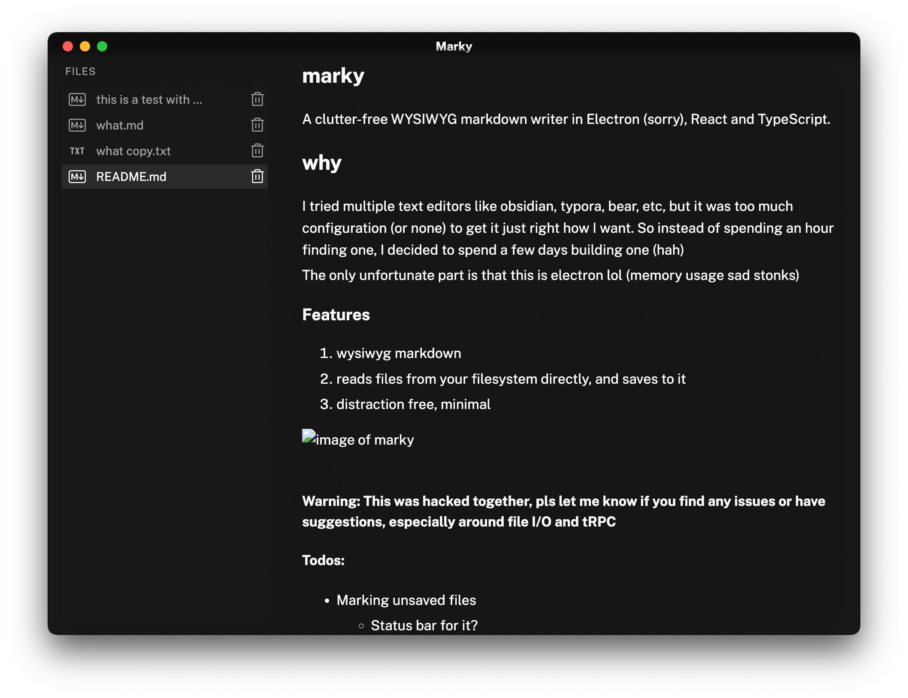

# marky

A clutter-free WYSIWYG markdown writer in Electron (sorry), React and TypeScript.

## why

I tried multiple text editors like obsidian, typora, bear, etc, but it was too much configuration (or none) to get it just right how I want. So instead of spending an hour finding one, I decided to spend a few days building one (hah)

The only unfortunate part is that this is electron lol (memory usage sad stonks)

### Features

this is based on the excellent codemirror editor (initially i was using milkdown which was escaping unwanted characters in the markdown output)

1. wysiwyg markdown
2.  reads files from your filesystem directly, and saves to it
3.  distraction free, minimal

> Warning: This was hacked together, pls let me know if you find any issues or have suggestions, especially around file I/O and tRPC

#### Todos:

- Marking unsaved files
  - Status bar for it?
- ~~Prevent opening binaries lol~~ Only allow opening `.md` files ✅
- Image display support (inline somehow?)
  - need to proxy the request somehow and get the file from user fs
- CMD+K bar to search for opened files
- Goddamn need to find why whitespace in the middle is getting trimmed
  - text editing moment
- Autosave
  - Need efficient file I/O before that
  - Currently just overwrite the entire content
- Directory support (?)
- Tabs (?)

---
